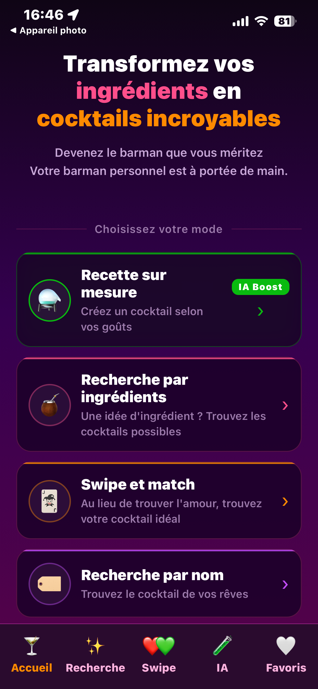
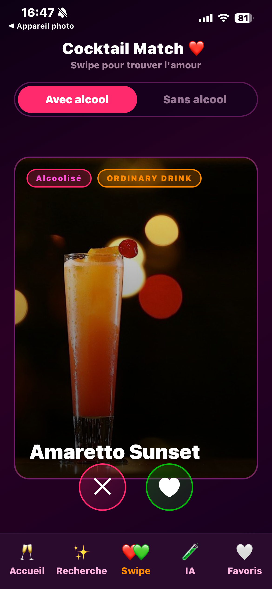
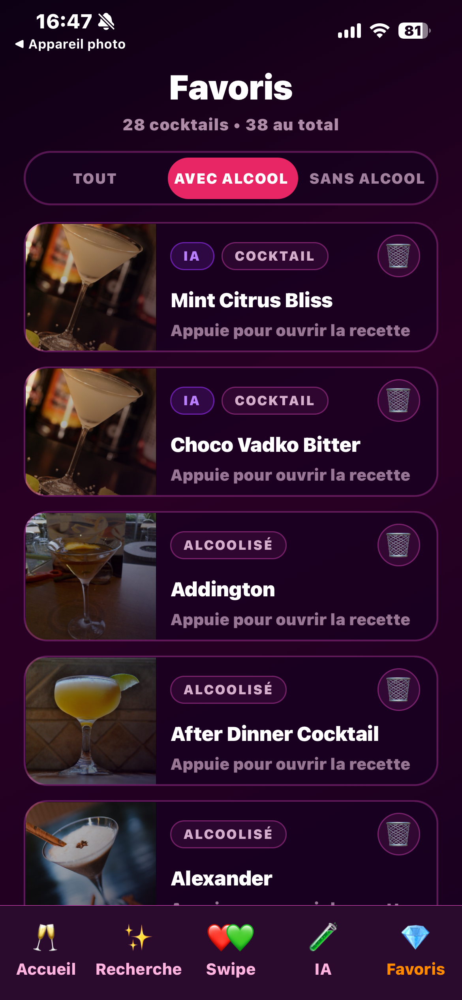

# 🍹 Cocktail Maker — Frontend

Application mobile de découverte et de création de cocktails, avec un mixologue IA intégré.

## Présentation

Cocktail Maker permet de trouver des cocktails par ingrédients, par nom, ou de se laisser surprendre via un système de swipe. L'application intègre également un générateur de recettes originales propulsé par l'IA, capable de créer des cocktails sur mesure selon les goûts et contraintes de l'utilisateur.

**Projet personnel** développé en complément de ma formation à La Capsule.

## Fonctionnalités

- **Recherche par ingrédients** — Saisir ses ingrédients disponibles et obtenir les cocktails réalisables, classés par score de correspondance
- **Recherche par nom** — Recherche instantanée avec debounce
- **Swipe & Match** — Parcourir des cocktails en swipant (like/dislike), style Tinder, avec ajout automatique aux favoris
- **Mixologue IA** — Générer des recettes originales en précisant ses goûts, ingrédients, format (long/short), force et contraintes alimentaires
- **Favoris** — Sauvegarder ses cocktails préférés avec persistance locale, filtrage alcool/sans alcool
- **Toggle alcool / sans alcool** — Disponible sur le swipe et le générateur IA

## Stack technique

- **React Native** avec **Expo**
- **Redux Toolkit** + **Redux Persist** (AsyncStorage) pour la gestion d'état
- **React Navigation** (Stack + Bottom Tabs)
- **Animated API** + **PanResponder** pour les animations de swipe
- **Expo Linear Gradient** pour le design UI

## Installation

```bash
git clone https://github.com/sofianetirecht/Cocktail-Maker-frontend.git

cd cocktail-maker-frontend
yarn install
npx expo start
```

> Le backend doit être lancé séparément. Voir le repo [Cocktail Maker Backend](https://github.com/TON_USERNAME/cocktail-maker-backend).

## Architecture du projet

```
├── App.js                 # Navigation principale (Tabs + Stack)
├── screens/
│   ├── HomeScreen.tsx      # Écran d'accueil avec menu
│   ├── SearchScreen.tsx    # Recherche par ingrédients
│   ├── SearchByNameScreen.js # Recherche par nom
│   ├── SurpriseScreen.js   # Swipe & Match
│   ├── AIRecipeScreen.tsx   # Mixologue IA
│   ├── DetailsScreen.tsx    # Détails d'un cocktail (API ou IA)
│   └── FavoritesScreen.tsx  # Gestion des favoris
├── reducers/
│   ├── store.js            # Configuration Redux + persistance
│   └── favorites.js        # Slice des favoris
└── components/
    ├── BackButton.js       # Bouton retour animé
    └── SearchByName.js     # Composant de recherche
```

## Screenshots





## Auteur

**Sofiane Tirecht** — Développeur Web & Mobile Fullstack
